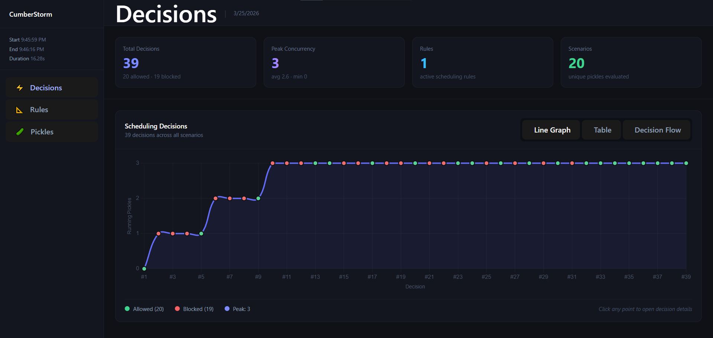
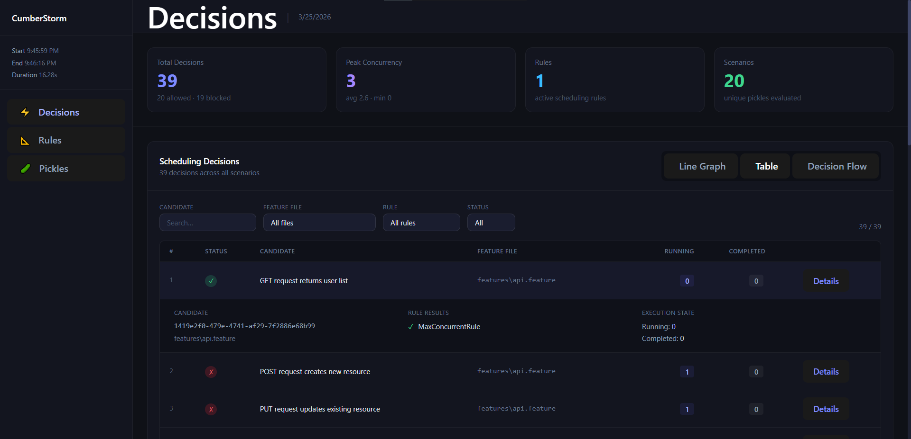
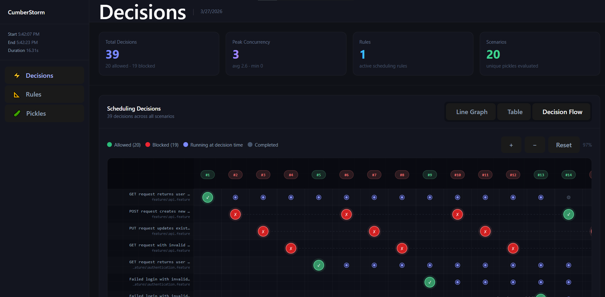
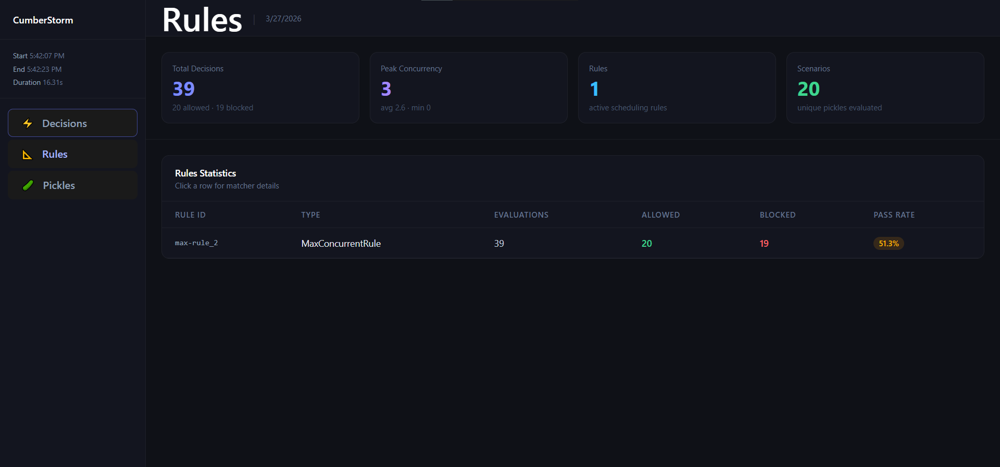
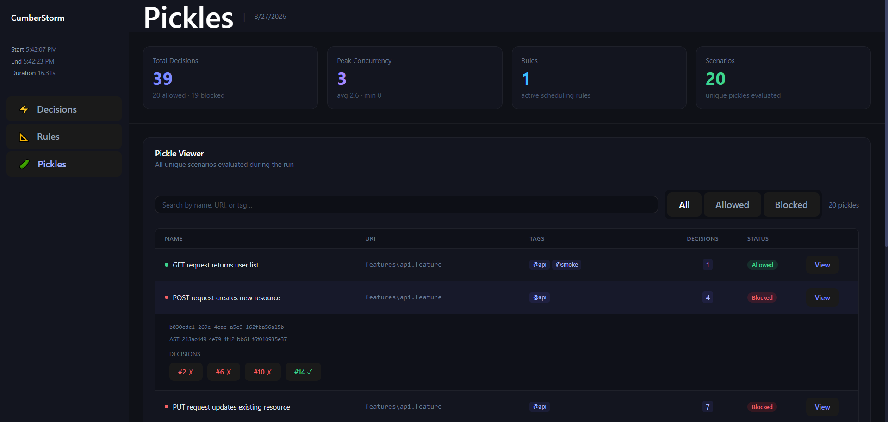

<div align="center">


# CumberStorm 

**Tame the storm in your Cucumber parallel test runs.**

A declarative scheduling rules engine for [Cucumber.js](https://github.com/cucumber/cucumber-js) that controls which scenarios can run concurrently — eliminating race conditions, database conflicts, and ordering issues without touching your test code.

[](https://github.com/omaromdhane/cumber-storm/actions/workflows/ci.yml)
[](https://www.npmjs.com/package/@cumberstorm/core)
[](https://www.npmjs.com/package/@cumberstorm/core)
[](LICENSE)
[](https://nodejs.org)
[](https://github.com/cucumber/cucumber-js)

</div>

---

---

## Table of Contents

- [Why CumberStorm?](#why-cumberstorm)
- [Installation](#installation)
- [Quick Start](#quick-start)
- [Configuration File](#configuration-file)
- [Rules](#rules)
  - [max-concurrent](#max-concurrent)
  - [exclusive](#exclusive)
  - [sequential](#sequential)
- [Matchers](#matchers)
  - [Matcher Fields](#matcher-fields)
  - [Matcher Options](#matcher-options)
  - [Matching Strategies](#matching-strategies)
- [API Reference](#api-reference)
- [HTML Report](#html-report)
- [Logging](#logging)
- [Recipes](#recipes)
- [Development](#development)

---

## Why CumberStorm?

Cucumber's `--parallel` flag runs scenarios concurrently with no awareness of shared resources. This causes:

- **Flaky tests** — two scenarios write to the same database table simultaneously
- **Port conflicts** — multiple scenarios start the same server on the same port
- **Order-sensitive failures** — a scenario depends on state created by a previous one

CumberStorm plugs directly into Cucumber's `setParallelCanAssign` hook and evaluates your rules before each scenario is allowed to start — no monkey-patching, no wrappers, no changes to your step definitions.

---

## Installation

```bash
npm install --save-dev @cumberstorm/core
```

Requires Node.js >= 18 and `@cucumber/cucumber` >= 10.

---

## Quick Start

**1. Create `cumber-storm.json` in your project root:**

```json
{
  "rules": [
    {
      "type": "max-concurrent",
      "max": 1,
      "match": {
        "allTags": ["@database"]
      }
    }
  ]
}
```

**2. Add CumberStorm to your Cucumber support file:**

```ts
// support/setup.ts  (or world.ts, hooks.ts — any file loaded by Cucumber)
import { setParallelCanAssign } from '@cucumber/cucumber';
import { CumberStorm } from '@cumberstorm/core';

if (!process.env.CUCUMBER_WORKER_ID) { // Cumberstorm should be created at the root node of cucumber
  new CumberStorm({ setParallelCanAssign });
}
```

**3. Run Cucumber with `--parallel`:**

```bash
npx cucumber-js --parallel 4
```

CumberStorm enforces your rules and writes an HTML report to `.cumberstorm/reports/`.

> **Important:** The `CumberStorm` constructor must be called in the **main process**, not inside a `Before`/`After` hook (which run in worker processes). Place it at the top level of a support file.

---

## Configuration File

CumberStorm looks for `cumber-storm.json` in `process.cwd()` by default. You can override this:

```ts
new CumberStorm({
  setParallelCanAssign,
  configPath: './config/cumber-storm.json',
});
```

### Full schema

```json
{
  "rules": [
    // one or more rule objects — see Rules section
  ]
}
```

The file is validated at startup. If it contains unknown keys or invalid values, CumberStorm throws with a descriptive error listing every problem.

---

## Rules

Each rule in the `rules` array is one of three types. Rules are evaluated in order — a scenario is allowed to start only if **all** rules permit it.

### `max-concurrent`

Limits how many scenarios matching a given criteria can run at the same time.

```json
{
  "type": "max-concurrent",
  "max": 2,
  "match": { "allTags": ["@slow"] }
}
```

| Field | Type | Required | Description |
|-------|------|----------|-------------|
| `type` | `"max-concurrent"` | ✓ | Rule type identifier |
| `max` | positive integer | ✓ | Maximum number of matching scenarios allowed to run simultaneously |
| `match` | [Matcher](#matchers) | ✓ | Criteria for which scenarios this rule applies to |

**How it works:** When a scenario is a candidate to start, CumberStorm counts how many currently-running scenarios match the same `match` criteria. If that count is already `max`, the candidate is blocked until one finishes.

**Example — limit database tests to 1 at a time:**
```json
{
  "type": "max-concurrent",
  "max": 1,
  "match": { "allTags": ["@database"] }
}
```

**Example — limit slow tests to 2, but only in a specific feature file:**
```json
{
  "type": "max-concurrent",
  "max": 2,
  "match": {
    "featureFileName": "checkout.feature",
    "options": { "strategy": "exact" }
  }
}
```

---

### `exclusive`

Scenarios in different groups cannot run at the same time. Scenarios within the same group can still run concurrently.

```json
{
  "type": "exclusive",
  "groups": [
    { "allTags": ["@read-db"] },
    { "allTags": ["@write-db"] }
  ]
}
```

| Field | Type | Required | Description |
|-------|------|----------|-------------|
| `type` | `"exclusive"` | ✓ | Rule type identifier |
| `groups` | [Matcher](#matchers)[] | ✓ | Two or more groups that are mutually exclusive |

**How it works:** Each matcher defines a group. If a candidate belongs to group A and any scenario from group B is currently running, the candidate is blocked. Scenarios that don't match any group are unaffected.

**Example — reads and writes can't overlap:**
```json
{
  "type": "exclusive",
  "groups": [
    { "allTags": ["@read-db"] },
    { "allTags": ["@write-db"] }
  ]
}
```

**Example — three mutually exclusive feature areas:**
```json
{
  "type": "exclusive",
  "groups": [
    { "uri": "features/payments" },
    { "uri": "features/inventory" },
    { "uri": "features/shipping" }
  ]
}
```

---

### `sequential`

Enforces a strict execution order between specific scenarios. Each matcher must match exactly one scenario. The scenario matched by `order[0]` must complete before `order[1]` can start, and so on.

```json
{
  "type": "sequential",
  "order": [
    { "scenarioName": "Seed the database" },
    { "scenarioName": "Run the migration" },
    { "scenarioName": "Verify data integrity" }
  ]
}
```

| Field | Type | Required | Description |
|-------|------|----------|-------------|
| `type` | `"sequential"` | ✓ | Rule type identifier |
| `order` | [Matcher](#matchers)[] | ✓ | Ordered list of matchers defining the execution sequence |

**How it works:** Scenarios not matched by any entry in `order` are unaffected and can run freely. Matched scenarios are blocked until all preceding entries in the sequence have completed.

**Example — setup → test → teardown:**
```json
{
  "type": "sequential",
  "order": [
    { "scenarioName": "Create test user" },
    { "scenarioName": "Verify user can log in" },
    { "scenarioName": "Delete test user" }
  ]
}
```

**Example — using regex to match a group of setup scenarios:**
```json
{
  "type": "sequential",
  "order": [
    { "scenarioName": ".*setup.*", "options": { "strategy": "regex", "ignoreCase": true } },
    { "scenarioName": ".*teardown.*", "options": { "strategy": "regex", "ignoreCase": true } }
  ]
}
```

---

## Matchers

A matcher defines which scenarios a rule applies to. Every rule field that accepts a matcher (`match`, `groups[]`, `order[]`) uses the same shape.

### Matcher Fields

Exactly **one** of the following fields must be specified per matcher:

| Field | Type | Description |
|-------|------|-------------|
| `scenarioName` | `string` | Match by scenario name |
| `allTags` | `string[]` | Match scenarios that have **all** of the specified tags |
| `anyTag` | `string[]` | Match scenarios that have **any** of the specified tags |
| `uri` | `string` | Match by the scenario's feature file path |
| `featureFileName` | `string` | Match by the feature file name only (no path) |

### Matcher Options

Each matcher accepts an optional `options` object:

```json
{
  "allTags": ["@slow"],
  "options": {
    "strategy": "exact",
    "ignoreCase": false
  }
}
```

| Option | Type | Default | Description |
|--------|------|---------|-------------|
| `strategy` | `"exact"` \| `"regex"` | `"regex"` | How the value is matched against the scenario |
| `ignoreCase` | `boolean` | `false` | Whether matching is case-insensitive |

### Matching Strategies

#### `"regex"` (default)

The matcher value is treated as a regular expression.

```json
{ "scenarioName": "User can (login|register)", "options": { "strategy": "regex" } }
{ "uri": "features/auth/.*", "options": { "strategy": "regex" } }
{ "allTags": ["@smoke-.*"], "options": { "strategy": "regex" } }
```

#### `"exact"`

The matcher value must be an exact string match.

```json
{ "scenarioName": "User can login with valid credentials", "options": { "strategy": "exact" } }
{ "featureFileName": "login.feature", "options": { "strategy": "exact" } }
{ "allTags": ["@smoke", "@auth"], "options": { "strategy": "exact" } }
```

> **Tag matching note:** For `allTags` and `anyTag`, the strategy applies to each individual tag string. With `"exact"`, the tag must match exactly (e.g. `"@smoke"` matches only `@smoke`). With `"regex"`, each tag is tested against the pattern (e.g. `"@smoke.*"` matches `@smoke`, `@smoke-fast`, etc.).

---

## API Reference

### `new CumberStorm(config)`

Creates a CumberStorm instance and registers the scheduling rules with Cucumber.

```ts
import { setParallelCanAssign } from '@cucumber/cucumber';
import { CumberStorm } from '@cumberstorm/core';

const cs = new CumberStorm({
  setParallelCanAssign,
  configPath: './cumber-storm.json',  // optional
  cwd: process.cwd(),                 // optional
  logDir: './.cumberstorm/logs',      // optional
  logLevel: 'info',                   // optional
  reportDir: './.cumberstorm/reports',// optional
  autoGenerateReport: true,           // optional, default: true
});
```

| Option | Type | Default | Description |
|--------|------|---------|-------------|
| `setParallelCanAssign` | `typeof setParallelCanAssign` | **required** | The function imported from `@cucumber/cucumber` |
| `configPath` | `string` | auto-detect | Explicit path to `cumber-storm.json` |
| `cwd` | `string` | `process.cwd()` | Working directory used for config auto-detection and default output paths |
| `logDir` | `string` | `.cumberstorm/logs` | Directory for log files |
| `logLevel` | `LogLevel` | `'info'` | Console log verbosity (`'error'`, `'warn'`, `'info'`, `'debug'`, `'silly'`) |
| `reportDir` | `string` | `.cumberstorm/reports` | Directory where HTML report is written |
| `autoGenerateReport` | `boolean` | `true` | Automatically generate a report when the process exits |

### `cs.getLogFilePath()`

Returns the absolute path to the current log file.

### `cs.getReportDir()`

Returns the absolute path to the report output directory.

---

## HTML Report

After each run, CumberStorm generates an HTML report at `.cumberstorm/reports/cumberstorm-report-<timestamp>.html`.

The report includes:

- **Overview** — total decisions, peak concurrency, rule count, unique scenarios
- **Scheduling Decisions** — three views:
  - *Line Graph* — concurrency level over time, click any point to inspect the decision
  - *Table View* — filterable list of every scheduling decision with running/completed counts
  - *Decision Flow* — swimlane matrix showing which scenarios were running at each decision point
- **Rules Statistics** — per-rule evaluation counts, pass rates, and matcher details
- **Pickle Viewer** — all unique scenarios with their tags, steps, and related decisions

The report is a single self-contained HTML file with no external dependencies.

### Example screenshots
**Line Graph — concurrency over time**


**Table View — filterable decision list**


**Decision Flow — swimlane matrix**


**Rules Statistics**


**Pickle Viewer**

---

## Logging

CumberStorm writes structured logs to `.cumberstorm/logs/cumberstorm-<timestamp>.log`.

Control console verbosity with `logLevel`:

```ts
import { CumberStorm, LogLevel } from '@cumberstorm/core';

new CumberStorm({
  setParallelCanAssign,
  logLevel: LogLevel.DEBUG,  // show all scheduling decisions in the console
});
```

Available levels (most → least verbose): `silly`, `debug`, `verbose`, `http`, `info`, `warn`, `error`.

---

## Recipes

### Prevent any parallel database access

```json
{
  "rules": [
    {
      "type": "max-concurrent",
      "max": 1,
      "match": { "anyTag": ["@database", "@db"] }
    }
  ]
}
```

### Separate read and write database tests

```json
{
  "rules": [
    {
      "type": "exclusive",
      "groups": [
        { "allTags": ["@db-read"] },
        { "allTags": ["@db-write"] }
      ]
    }
  ]
}
```

### Limit slow tests while keeping fast tests fully parallel

```json
{
  "rules": [
    {
      "type": "max-concurrent",
      "max": 2,
      "match": { "anyTag": ["@slow", "@e2e"] }
    }
  ]
}
```

### Enforce setup → test → teardown order

```json
{
  "rules": [
    {
      "type": "sequential",
      "order": [
        { "scenarioName": "Initialize test environment" },
        { "scenarioName": "Run smoke tests" },
        { "scenarioName": "Clean up test environment" }
      ]
    }
  ]
}
```

### Combine multiple rules

Rules are evaluated in order. A scenario must pass **all** rules to be allowed.

```json
{
  "rules": [
    {
      "type": "max-concurrent",
      "max": 3,
      "match": { "anyTag": ["@slow"] }
    },
    {
      "type": "exclusive",
      "groups": [
        { "allTags": ["@database"] },
        { "allTags": ["@external-api"] }
      ]
    },
    {
      "type": "sequential",
      "order": [
        { "scenarioName": "Seed test data" },
        { "scenarioName": "Verify seeded data" }
      ]
    }
  ]
}
```

### Use a custom config path

```ts
new CumberStorm({
  setParallelCanAssign,
  configPath: path.join(__dirname, '../config/cumber-storm.json'),
});
```

### Disable automatic report generation

```ts
const cs = new CumberStorm({
  setParallelCanAssign,
  autoGenerateReport: false,
});

// Generate manually after the run
process.on('exit', () => cs.generateReport());
```

---

## Development

```bash
# Install all dependencies
npm install

# Build all packages (reporting → core → html-reporter)
npm run build

# Run tests
npm test

# Type check all packages
npm run check-types

# Lint all packages
npm run lint

# Develop the HTML reporter with hot reload
npm run dev --workspace=src/html-reporter
```

### Monorepo structure

```
src/
├── core/               # @cumberstorm/core — rules engine, scheduler, reporter
│   └── src/
│       ├── api/        # Public CumberStorm class
│       ├── config/     # JSON config loading and validation
│       ├── execution/  # Parallel scheduler and pickle tracker
│       ├── matchers/   # Exact and regex matcher implementations
│       ├── reporting/  # Report generation and HTML output
│       └── rules/      # MaxConcurrent, Exclusive, Sequential rule classes
├── reporting/          # @cumberstorm/reporting — shared report types (browser-safe)
├── html-reporter/      # React + Vite report UI (built into core/dist)
├── eslint-config/      # Shared ESLint configuration
└── typescript-config/  # Shared tsconfig bases (node.json, browser.json)
```

---

## License

MIT — see [LICENSE](LICENSE).
